# AI Job Assistant — Architecture Overview

> Last updated: 2026-05-27 · See [PROJECT_PLAN.md](../PROJECT_PLAN.md) for the build phases.

## System diagram

```mermaid
flowchart TB
    %% ─── Styling ─────────────────────────────────────────────
    classDef ui        fill:#E3F2FD,stroke:#1976D2,color:#0D47A1
    classDef api       fill:#E8F5E9,stroke:#388E3C,color:#1B5E20
    classDef agent     fill:#FFF3E0,stroke:#F57C00,color:#E65100
    classDef tools     fill:#F3E5F5,stroke:#7B1FA2,color:#4A148C
    classDef data      fill:#ECEFF1,stroke:#455A64,color:#263238
    classDef ext       fill:#FFEBEE,stroke:#C62828,color:#B71C1C
    classDef ops       fill:#FFFDE7,stroke:#F9A825,color:#F57F17

    %% ─── User Interface ─────────────────────────────────────
    subgraph UI[" Frontend "]
        ST["Streamlit App<br/><i>multi-page · streaming</i><br/><b>streamlit</b>"]:::ui
    end

    %% ─── API Gateway ────────────────────────────────────────
    subgraph GW[" API Gateway "]
        FA["FastAPI + Uvicorn<br/><i>SSE streaming · OpenAPI docs</i><br/><b>fastapi · pydantic · sse-starlette</b>"]:::api
    end

    %% ─── Agent Orchestration ────────────────────────────────
    subgraph ORCH[" Agent Orchestration "]
        LG["LangGraph Agent<br/><i>plan → tool-select → execute → reflect</i><br/><b>langgraph · langchain</b>"]:::agent
        MEM["Memory<br/><i>short: conversation<br/>long: vector recall</i>"]:::agent
        HITL["Human-in-the-Loop<br/><i>checkpoint approvals</i>"]:::agent
    end

    %% ─── Tools / Capabilities ───────────────────────────────
    subgraph CAPS[" Tools / Capabilities "]
        MCP["MCP Server<br/><i>job-search</i><br/><b>mcp (python SDK)</b>"]:::tools
        RAG["RAG Retriever<br/><i>hybrid BM25 + dense + rerank</i><br/><b>chromadb · rank-bm25 · sentence-transformers</b>"]:::tools
        PRS["Resume Parser<br/><b>UnstructuredPDFLoader · pdfplumber</b>"]:::tools
        GAP["Gap Analyzer<br/><b>langchain-openai · gpt-4o-mini</b>"]:::tools
        PRJ["Project Suggester<br/><b>langchain-openai</b>"]:::tools
        INT["Interview Generator<br/><b>langchain-openai</b>"]:::tools
    end

    %% ─── Data Layer ─────────────────────────────────────────
    subgraph DATA[" Data Layer "]
        CHR["Chroma Vector Store<br/><i>resume + job embeddings</i><br/><b>chromadb · langchain-chroma</b>"]:::data
        SQL["SQLite<br/><i>jobs cache · sessions · eval results</i><br/><b>sqlalchemy · aiosqlite</b>"]:::data
        FS["Local Filesystem<br/><i>uploaded PDFs</i>"]:::data
    end

    %% ─── External APIs ──────────────────────────────────────
    subgraph EXT[" External APIs "]
        ADZ["Adzuna<br/><i>AU job listings</i><br/><b>httpx</b>"]:::ext
        OAI["OpenAI<br/><b>gpt-4o-mini<br/>text-embedding-3-small</b>"]:::ext
        CD["Claude Desktop<br/><i>MCP client demo</i>"]:::ext
    end

    %% ─── LLMOps (cross-cutting) ─────────────────────────────
    subgraph OPS[" LLMOps · cross-cutting "]
        LF["Langfuse v3<br/><i>traces · costs · evals · prompt mgmt</i><br/><b>langfuse · postgres · clickhouse · redis</b>"]:::ops
        PF["Promptfoo<br/><i>golden-dataset evals</i>"]:::ops
        GH["GitHub Actions<br/><i>lint · tests · prompt regression gate</i>"]:::ops
    end

    %% ─── Flow ───────────────────────────────────────────────
    ST -->|HTTP / SSE| FA
    FA --> LG
    LG <--> MEM
    LG --> HITL
    LG -->|tool call| MCP
    LG -->|tool call| RAG
    LG -->|tool call| PRS
    LG -->|tool call| GAP
    LG -->|tool call| PRJ
    LG -->|tool call| INT

    MCP --> ADZ
    RAG --> CHR
    PRS --> FS
    PRS --> CHR
    GAP --> OAI
    PRJ --> OAI
    INT --> OAI
    LG -.->|LLM calls| OAI
    MCP <-.->|MCP protocol| CD

    CAPS --> SQL

    %% Observability fan-in
    LG -.->|traces| LF
    GAP -.->|traces| LF
    PRJ -.->|traces| LF
    INT -.->|traces| LF
    RAG -.->|traces| LF
    MCP -.->|traces| LF
    PF -.->|results| LF
    GH -->|runs| PF
```

## Tech stack at a glance

| Layer | Technology | Purpose |
|---|---|---|
| **Frontend** | Streamlit | Multi-page user workflow with streaming responses |
| **API Gateway** | FastAPI, Uvicorn, Pydantic, `sse-starlette` | Async HTTP gateway with SSE streaming and auto OpenAPI docs |
| **Agent** | LangGraph, LangChain | State-machine agent with planner / tool-router / reflector nodes, HITL checkpoints, streaming |
| **LLM** | OpenAI `gpt-4o-mini` via `langchain-openai` | All reasoning + content generation |
| **Embeddings** | OpenAI `text-embedding-3-small` | Dense vectors for resume + job descriptions |
| **Vector Store** | Chroma (`langchain-chroma`, `chromadb`) | Resume and job embedding storage |
| **Hybrid Retrieval** | `rank-bm25` + Chroma dense + RRF fusion | Lexical + semantic recall |
| **Reranker** | `sentence-transformers` cross-encoder | Top-k reordering after hybrid retrieval |
| **PDF Parsing** | `UnstructuredPDFLoader`, `pdfplumber`, `pdfminer.six` | Resume text extraction (mirrors `pdf-rag`) |
| **Database** | SQLite via `sqlalchemy` + `aiosqlite` | Jobs cache, session history, eval results |
| **MCP** | `mcp` Python SDK | One job-search server, Claude Desktop as client |
| **Job API** | Adzuna via `httpx` | AU job listings |
| **Observability** | Langfuse v3 (self-hosted: web, worker, Postgres, ClickHouse, Redis) | Traces, cost tracking, eval store, prompt versioning |
| **Evals** | Promptfoo | Golden-dataset evals run from CI |
| **CI/CD** | GitHub Actions | Lint, tests, prompt regression gate |
| **Container** | Docker, docker-compose, `uv` | Reproducible local stack (Ubuntu 22.04 + `uv pip install`) |
| **Config** | `pydantic-settings`, `python-dotenv` | Typed `.env`-driven configuration |
| **Logging** | stdlib `logging` + custom JSON/pretty formatters + `ContextVar` | Per-request correlation IDs |

## Skills demonstrated

| Skill area | How it shows up |
|---|---|
| **Agentic AI** | LangGraph agent with planner → tool selection → execution → reflection. Memory, HITL, streaming. |
| **MCP (Model Context Protocol)** | Job-search shipped as an MCP server; consumed from Claude Desktop. |
| **RAG** | Hybrid (BM25 + dense), cross-encoder reranking, multi-query, retrieval evals (recall@k, MRR). |
| **LLMOps** | Langfuse tracing from request #1. Promptfoo golden-dataset evals. GitHub Actions prompt-regression gate. Cost & latency dashboards. |
| **Engineering** | FastAPI async + SSE streaming, Pydantic everywhere, structured logging with correlation IDs, Docker, CI. |
| **(Optional) Training** | Phase H: LoRA fine-tune of a small classifier (e.g. seniority detector). |

## Build status

Tracked in [PROJECT_PLAN.md](../PROJECT_PLAN.md) and your todo list.

- ✅ Phase A (Foundation + Langfuse) — files written, smoke test pending (A9)
- ⏳ Phase B (RAG capability)
- ⏳ Phase C (Tool implementations)
- ⏳ Phase D (LangGraph agent)
- ⏳ Phase E (MCP server)
- ⏳ Phase F (Evals + CI)
- ⏳ Phase G (Streamlit UI polish)
- ⏳ Phase H (optional fine-tuning)
