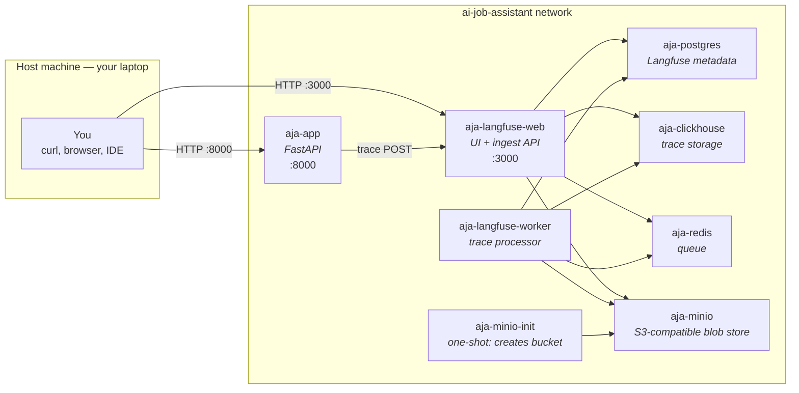

# Phase A — Foundation & Observability

> A complete walkthrough of what we built, why, and how the pieces fit together.
> Read alongside the files in the repo. Last updated: 2026-05-31.

---

## 1. What Phase A is (and isn't)

**Phase A's goal:** stand up the *plumbing* the rest of the project will use — but with **observability wired in from the very first request**. No actual job-search features yet; just the runway that lets every future LLM call be traced, logged, and reasoned about.

**Phase A's "Done when" criteria, all met:**
1. ✅ `docker compose up -d` brings the whole local stack online
2. ✅ FastAPI `/health` returns `200 OK` with subsystem statuses
3. ✅ A real LLM call from inside the app appears as a trace in the Langfuse UI

**What's intentionally NOT in Phase A:**
- No RAG, no agent, no MCP, no UI, no evals (those are Phases B–G)
- No production hardening — single-user dev only
- No auth, no rate limiting, no CORS
- No tests beyond the smoke script

Phase A is the *boring but load-bearing layer*. Every later phase plugs into it.

---

## 2. The runtime picture

When you run:

```bash
docker compose -f docker/docker-compose.yml --env-file .env up -d
```

…nine containers come up and talk to each other:



**Why so many containers?** Langfuse v3 (the modern LLMOps stack) is a real distributed system:
- **Postgres**: structured metadata (users, projects, prompts, eval runs)
- **ClickHouse**: high-volume trace + observation storage (columnar, fast)
- **Redis**: queue for asynchronous trace ingestion
- **MinIO**: S3-compatible blob store for large trace payloads (long prompts, image inputs)
- **langfuse-web**: HTTP API + Next.js UI
- **langfuse-worker**: pulls from Redis, persists to ClickHouse, computes aggregates

That same architecture runs in Langfuse Cloud at scale. Running it locally is the same shape — exercising it is a real LLMOps skill.

---

## 3. File-by-file walkthrough

### 3.1 `requirements.txt`

The dependency manifest. Mirrors `pdf-rag`'s package choices (Chroma, LangChain, OpenAI, FastAPI, Streamlit) and adds what later phases need:
- `langgraph` (Phase D agent)
- `mcp` (Phase E)
- `langfuse` (LLMOps, used from Phase A onward)
- `rank-bm25` + `sentence-transformers` (Phase B hybrid retrieval)
- `httpx` (Phase C Adzuna client)

We install with `uv pip install --system` in the Dockerfile — 10-100× faster than plain pip.

### 3.2 `.env.example` (and your `.env`)

Single source of truth for runtime configuration. Loaded by `pydantic-settings` via `python-dotenv`.

**Important quirk** (learned the hard way): pydantic-settings reads the literal value including quote characters. So:
- ✅ `LOG_LEVEL=INFO`
- ❌ `LOG_LEVEL="INFO"` (Pydantic sees the string `"INFO"` with quotes and barfs)

`.env.example` is committed; `.env` is gitignored.

### 3.3 `app/core/config.py` — typed configuration

```python
class Settings(BaseSettings):
    openai_api_key: str                  # no default → fail fast at startup
    langfuse_public_key: str = ""        # empty default → optional in dev
    chroma_path: Path = Path("./data/vector_store")
    ...
```

**Why pydantic-settings rather than `os.getenv()`:**
- Type coercion (`"true"` → `True`, paths → `Path`)
- One import + IDE autocomplete everywhere
- Fail at startup if a required var is missing — never at request time
- `langfuse_enabled` property hides the "are keys present" question from callers
- `@lru_cache(maxsize=1)` makes `get_settings()` a singleton

**The cascade of where values come from:**
1. Class defaults (e.g. `openai_model: str = "gpt-4o-mini"`)
2. `.env` file
3. Process environment (overrides .env)
4. `environment:` block in `docker-compose.yml` (overrides .env when running in the container)

This last point matters: `LANGFUSE_HOST=http://localhost:3000` lives in your `.env`, but inside the container we *override* it with `LANGFUSE_HOST=http://langfuse-web:3000` so the app talks to the langfuse-web container, not the host's localhost.

### 3.4 `app/core/logging.py` — structured logging

Two formatters and a `ContextVar`:
- **`JsonFormatter`** — one JSON object per log line. Used when `APP_ENV != "dev"`. Suitable for log aggregators (CloudWatch, Datadog, etc.).
- **`PrettyFormatter`** — human-readable single line. Used in dev so your terminal isn't a wall of braces.
- **`request_id_var: ContextVar[str]`** — survives async context switches. The middleware in `app/main.py` sets it per request; every log call automatically includes it.

**Why correlation IDs matter in this project:** an agent invocation in Phase D will fan out to 5+ tool calls, each producing logs and Langfuse spans. Without a shared request ID stitching them together, debugging is misery.

**Why stdlib instead of `structlog`:** Langfuse will be carrying most of the observability load (traces, spans, costs, hierarchical context). Logs are the *unhappy path* fallback. Plain `logging` keeps the dep list lean.

### 3.5 `app/observability/langfuse_client.py` — Langfuse wiring

Three functions and one rule:
- `get_langfuse() -> Langfuse | None` — cached singleton, returns `None` when keys are absent
- `get_langchain_callback() -> CallbackHandler | None` — drop-in callback for any LangChain `Runnable`
- `shutdown_langfuse()` — flushes the async event queue at process exit
- `healthcheck()` — used by FastAPI `/health` to report status

**The rule:** functions return `None` (not silent no-op stubs) when Langfuse is disabled. This forces callers to do `if cb: ...` explicitly. Cleaner than fake objects that swallow data and lie about it.

**How traces actually get to Langfuse:**

```
your code  →  LangChain Runnable.invoke(config={"callbacks": [cb]})
              │
              ▼
         CallbackHandler (Phase A: get_langchain_callback)
              │   buffers events in-memory
              ▼
         Langfuse Python client  ──→  HTTP POST  ──→  langfuse-web:3000
              │
              ▼ (flushed on shutdown or every N seconds)
         enqueued in Redis
              │
              ▼
         langfuse-worker pops, writes to ClickHouse + Postgres
              │
              ▼
         Visible in the UI within ~1-2 seconds
```

The `shutdown_langfuse()` in `app/main.py`'s lifespan ensures the last few events flush before the process exits — without it, short-lived scripts can lose the tail of their traces.

### 3.6 `app/main.py` — FastAPI application

Three things to understand:

**(a) The `lifespan` context manager** (lines around `@asynccontextmanager`):
- Anything before `yield` runs at startup (once)
- Anything after `yield` runs at shutdown (once)
- Modern FastAPI pattern — replaces deprecated `@app.on_event`
- Order matters: we `configure_logging` first so all subsequent startup messages are formatted

**(b) The request_id middleware:**
```python
@app.middleware("http")
async def request_id_middleware(request, call_next):
    rid = request.headers.get("x-request-id") or uuid.uuid4().hex
    token = request_id_var.set(rid)
    try:
        response = await call_next(request)
        response.headers["x-request-id"] = rid
        return response
    finally:
        request_id_var.reset(token)
```
- Honours an incoming `x-request-id` (useful when a client like Streamlit forwards one)
- Otherwise mints a UUID
- Sets it in the `ContextVar` so every log line within this request carries it
- Echoes it back in the response header so clients can correlate too
- `reset(token)` in `finally` prevents leaking the value into other async tasks

**(c) The `/health` endpoint:**
- Liveness signal (FastAPI is running and accepting requests)
- Subsystem report (`langfuse.status: enabled|disabled` and reason)
- Used by your own ops (curl), and by Phase F's CI to know the stack is up

### 3.7 `docker/Dockerfile` — single image for all Python workloads

Single-stage Ubuntu 22.04 image, exactly mirroring pdf-rag's pattern. Key choices:
- **Ubuntu, not python:slim** — `unstructured[all-docs]` needs system libs (`libgl1`, `libglib2.0-0`, `poppler-utils`, `tesseract-ocr`) that slim Python images don't ship.
- **`uv` installs deps** — fast resolver, drop-in replacement for pip.
- **`requirements.txt` copied before the rest** — Docker layer caching: editing app code doesn't reinstall deps.
- **`PYTHONUNBUFFERED=1`** — logs flush immediately; without it `docker logs` looks frozen during long operations.
- **`PYTHONPATH=/workspace`** (set in `docker-compose.yml`) — lets ad-hoc scripts in `scripts/` import the `app` package.
- **`python-is-python3`** — installs the symlink so both `python` and `python3` work.

The image is ~3-4GB, dominated by `unstructured[all-docs]` + tesseract + ONNX layout models. Same cost as pdf-rag.

### 3.8 `docker/docker-compose.yml` — the local stack

The orchestration. Brings up the app + Langfuse's six-service backend.

**Notable design choices:**
- **YAML anchor (`x-langfuse-common`)** — shared env vars between `langfuse-web` and `langfuse-worker` defined once, reused via `<<: *langfuse-common`. Single source of truth = fewer drift bugs.
- **`condition: service_started`** (not `service_healthy`) for the app's depends_on — Langfuse may take 90s+ to migrate Postgres + ClickHouse on first boot; our app handles "Langfuse missing" gracefully, so a strict health gate would just block boot for no benefit.
- **MinIO + `minio-init`** — MinIO is required by Langfuse v3 for blob storage. The `minio-init` one-shot container creates the `langfuse` bucket using the `mc` CLI; without it Langfuse can't upload event payloads.
- **Named volumes for Postgres/ClickHouse/MinIO** — survive `docker compose down`; only lost on `down -v`.
- **Bind-mounts for `app/`, `prompts/`, `scripts/`** — hot reload: edit code on host, uvicorn (with `--reload`) picks it up inside the container.
- **`PYTHONPATH: /workspace`** — solves the "running scripts from container can't import `app`" problem cleanly for all future ad-hoc scripts.
- **`LANGFUSE_INIT_*` env vars** — bootstraps the org, project, and user on first boot so you don't have to click through the UI. Login: `dev@example.com` / `dev-password-change-me`.

### 3.9 `scripts/smoke_trace.py` — the Phase A finish-line proof

One file that exercises the whole stack: load settings → init Langfuse callback → invoke ChatOpenAI with the callback wired in → flush. If you see a trace appear in the Langfuse UI, Phase A works end-to-end. Run via:

```bash
docker compose -f docker/docker-compose.yml exec app python3 scripts/smoke_trace.py
```

---

## 4. Three cross-cutting concepts to keep in your head

### 4.1 The request lifecycle

```
client → uvicorn → request_id_middleware → route handler → response
                          │                       │
                          │                       └─ logs carry request_id
                          └─ binds request_id_var
                          
                          (on shutdown signal: lifespan teardown runs,
                           shutdown_langfuse() flushes queued events)
```

### 4.2 The trace lifecycle

```
LLM call ─→ LangChain CallbackHandler ─→ Langfuse client buffer
                                              │
                                              ▼ (HTTP POST, batched)
                                        langfuse-web:3000
                                              │
                                              ▼
                                            Redis queue
                                              │
                                              ▼
                                       langfuse-worker
                                              │
                                              ▼
                                     ClickHouse + Postgres
                                              │
                                              ▼
                                          Langfuse UI
```

This is asynchronous. Your code doesn't wait for the trace to land before returning the LLM response — important for latency, but means **you must `flush()` before exiting** short-lived processes.

### 4.3 The configuration cascade

```
class default in Settings  ◄ lowest priority
        ↓
.env file
        ↓
process environment (set in shell)
        ↓
docker-compose `environment:` block  ◄ highest priority
```

Want to override `LANGFUSE_HOST` just for the container? Put it in the `environment:` block. Want to set it for everything (local + container)? Put it in `.env`. Want to test a one-off value? `LANGFUSE_HOST=http://foo:1234 python3 some_script.py`.

---

## 5. Key design decisions

| Decision | Choice | Rationale |
|---|---|---|
| Vector store | Chroma | Matches pdf-rag, simple file-based persistence, good LangChain integration. FAISS was the original sprint plan but Chroma is more featureful. |
| PDF parser | UnstructuredPDFLoader | Same as pdf-rag. Handles layouts, OCR fallback. Heavier dep but proven. |
| LLM observability | Langfuse v3 (self-hosted) | Open source, full architecture (Postgres + ClickHouse + Redis + MinIO) is what production-grade LLMOps looks like. LangSmith is commercial. Phoenix is RAG-focused but less mature on prompts. |
| Agent framework | LangGraph (Phase D) | Most marketable today. State machine = explicit nodes/edges that map cleanly to traces. |
| Config | pydantic-settings | Typed, fail-fast, autocomplete. Same as pdf-rag's pattern. |
| Logging | stdlib + custom formatters + ContextVar | Zero deps, sufficient for our needs. Langfuse carries the heavy observability. |
| Container base | Ubuntu 22.04 + uv | Mirrors pdf-rag exactly. Necessary for `unstructured` system deps. |
| MCP scope | One server (job-search) | Demonstrates the skill without inflating the project. |
| Job sources | Adzuna only for v1 | Clean API, free tier. Seek/LinkedIn scrapers are fragile + deferred. |

---

## 6. Gotchas we hit during the smoke test (and how we fixed them)

These are real lessons worth keeping — Phase A's debugging tour:

| Symptom | Cause | Fix |
|---|---|---|
| `ValueError: Unknown level: '"INFO"'` | pydantic-settings read literal quote chars from `.env` | Remove surrounding `"` from `.env` string values |
| `LANGFUSE_S3_EVENT_UPLOAD_BUCKET: Invalid input: expected string, received undefined` | Langfuse v3 requires S3-compatible storage | Added MinIO + bucket-init container |
| `ENCRYPTION_KEY must be 256 bits, 64 string characters in hex` | YAML parsed `0000…0000` as integer 0, then cast back to string `"0"` (length 1) | Use a real 64-char hex value with letters, and/or quote it |
| `LANGFUSE_INIT_USER_EMAIL: Invalid input` | `dev@local` isn't a valid email (no TLD) | Changed to `dev@example.com` |
| `aja-app` stuck in `Created` state | `depends_on` required langfuse-web to be `(healthy)`, but the healthcheck command (`wget`) didn't exist in the langfuse image | Switched healthcheck to `node -e require('http').get(...)`; loosened depends_on to `service_started` |
| `service "app" is not running` after recreate | `docker compose restart` doesn't re-read `env_file` | Use `docker compose up -d --force-recreate app` |
| `executable file not found: python` | Ubuntu 22.04 only ships `python3` | Added `python-is-python3` to Dockerfile |
| `No such file: /workspace/scripts/smoke_trace.py` | `scripts/` wasn't bind-mounted | Added `../scripts:/workspace/scripts` volume |
| `ModuleNotFoundError: No module named 'app'` | `python3 scripts/foo.py` puts `scripts/` on path, not `/workspace` | Set `PYTHONPATH=/workspace` in compose env |

The pattern across most of these: **YAML and dotenv files are full of subtle string-parsing rules.** When in doubt, quote suspicious values and verify what actually arrives in the container with `docker compose exec app env | grep FOO`.

---

## 7. How to verify everything still works

The smoke test is the canonical proof. From the repo root:

```bash
# Bring stack up
docker compose -f docker/docker-compose.yml --env-file .env up -d

# Wait for langfuse-web to be ready (~60-90s on first boot, ~10s after)
docker compose -f docker/docker-compose.yml ps

# All services should be Up; aja-app should report (healthy) or just Up
# langfuse-web may say (unhealthy) — the curl below is the real test

# Confirm app is responding
curl -s http://localhost:8000/health | python3 -m json.tool

# Confirm Langfuse is responding
curl -i http://localhost:3000/api/public/health

# Send a trace
docker compose -f docker/docker-compose.yml exec app python3 scripts/smoke_trace.py

# View the trace at http://localhost:3000 → Tracing → Traces
```

If all four steps succeed, Phase A is healthy.

---

## 8. What's deliberately missing (and where it lands)

| Missing piece | Lands in |
|---|---|
| Resume parsing into a vector store | Phase B (RAG capability) |
| Adzuna job search | Phase C (Tool implementations) |
| Skill gap analysis, project suggestions, interview Q&A | Phase C |
| LangGraph agent that orchestrates the tools | Phase D |
| MCP server exposing job-search to Claude Desktop | Phase E |
| Golden eval datasets + CI prompt-regression gate | Phase F |
| Streamlit UI | Phase G |
| Optional: LoRA fine-tune | Phase H |

Each one plugs into the foundation Phase A built — and gets traced for free.

---

## 9. Tech stack actually used in Phase A

The dependencies and services *exercised* by Phase A. (The wider project stack — Chroma, LangGraph, MCP, Promptfoo, Streamlit, etc. — is reserved for later phases. See [architecture.md](architecture.md) for the full picture.)

### Application (Python)

| Component | Package(s) | Role in Phase A |
|---|---|---|
| Web framework | `fastapi`, `uvicorn[standard]` | Async HTTP gateway, lifespan-managed startup/shutdown |
| Config | `pydantic`, `pydantic-settings`, `python-dotenv` | Typed env-driven configuration with fail-fast validation |
| Logging | stdlib `logging`, `contextvars` | JSON/pretty formatters, ContextVar-based request correlation |
| LLM client | `openai`, `langchain`, `langchain-openai` | Smoke-test LLM call (will dominate Phases C–D) |
| LLMOps SDK | `langfuse`, `langfuse.langchain` | Trace client + LangChain CallbackHandler |

### Infrastructure (Docker)

| Component | Image | Role |
|---|---|---|
| App container | Custom (Ubuntu 22.04 + `uv`) | Runs uvicorn, holds all Python deps |
| Langfuse web | `langfuse/langfuse:3` | UI + trace ingest API (port 3000) |
| Langfuse worker | `langfuse/langfuse-worker:3` | Async trace processor (Redis → ClickHouse) |
| Metadata DB | `postgres:16-alpine` | Langfuse projects, users, prompts |
| Trace storage | `clickhouse/clickhouse-server:24.3` | Columnar storage of traces/observations |
| Queue | `redis:7-alpine` | Trace ingestion buffer |
| Blob store | `minio/minio:latest` | S3-compatible storage for large trace payloads |
| Bucket bootstrap | `minio/mc:latest` | One-shot init container creates the `langfuse` bucket |

### External

| Service | Usage |
|---|---|
| OpenAI API | `gpt-4o-mini` smoke-test call; `text-embedding-3-small` reserved for Phase B |

---

## 10. Skills demonstrated by Phase A

What this phase actually proves you can do — useful as talking points in interviews and résumé bullets.

### LLMOps foundation
- **Self-hosted a production-shaped Langfuse v3 stack** (six services: web + worker + Postgres + ClickHouse + Redis + MinIO). Same architecture as Langfuse Cloud — local exercise of the real thing.
- **Wired observability from request #1** rather than bolting it on later. Every LLM call in every future phase is automatically traced via the LangChain CallbackHandler.
- **Solved the graceful-shutdown problem for async telemetry**: `shutdown_langfuse()` flushes the queue before the process exits so short-lived scripts don't lose their last traces.

### Modern Python web engineering
- **FastAPI lifespan context manager** — modern replacement for deprecated `@app.on_event`; cleanly shares state between startup and teardown.
- **Async-safe correlation IDs via `ContextVar`** — survives async context switches where thread-locals would not.
- **Per-request request-ID middleware** that honours incoming `x-request-id` headers (distributed-tracing friendly) and echoes them back in responses.
- **Structured logging with environment-aware formatters**: JSON for prod aggregators, pretty for dev terminals, chosen at startup from `APP_ENV`.
- **`/health` endpoint reports subsystem status** rather than a bare `{"status": "ok"}` — gives ops a real debug surface.

### Configuration & secret management
- **Typed config via pydantic-settings** with fail-fast validation (`openai_api_key: str` with no default means the app refuses to start without it).
- **Conscious use of the configuration cascade**: class defaults → `.env` → process env → docker-compose `environment:`. Deliberately override `LANGFUSE_HOST` only inside the container so the same `.env` works both locally and in Docker.
- **`.env` security hygiene**: `.env` gitignored; `.env.example` committed with placeholders; `.dockerignore` keeps `.env` out of image layers.

### Container orchestration
- **Multi-service docker-compose** with health checks and dependency ordering (`depends_on: condition: service_started` vs `service_healthy`, understood and chosen deliberately).
- **YAML anchors** (`x-langfuse-common`) to DRY out shared env vars across web + worker.
- **Bind-mounts for hot reload** (`app/`, `prompts/`, `scripts/`) vs **named volumes for persistence** (Postgres, ClickHouse, MinIO) — chosen per use case.
- **One-shot init container pattern** (`minio-init`) for infrastructure bootstrap (creates the S3 bucket).
- **Container image best practices**: layer caching (deps before source), `PYTHONUNBUFFERED=1`, exec-form CMD for clean signal propagation, OS deps via `--no-install-recommends`.

### Real-world LLMOps debugging
The gotchas section is more than a war story — each one is a transferable skill:
- Diagnosed **YAML number-parsing ambiguity** (`0000…0000` parsed as integer 0, then cast back to `"0"`).
- Diagnosed **Langfuse v3 healthcheck failure** (missing `wget`/`curl` in the upstream image) — switched to Node's stdlib `http.get`.
- Diagnosed **docker-compose `restart` not re-reading `env_file`** — distinguished from `up -d --force-recreate`.
- Diagnosed **`sys.path` issues for ad-hoc scripts** — solved at the container level via `PYTHONPATH=/workspace`, not by path-hacking each script.
- Diagnosed **pydantic-settings reading literal quote characters** from `.env`.

These are the integration bugs you hit in any real LLMOps deployment. Being able to reason about them — and write a reproducible fix into a compose file — is the day-job of a GenAI engineer.

---

## 11. Questions to ask yourself (interview-readiness check)

Can you answer these without looking?

1. Why is Langfuse self-hosted with ClickHouse + Redis + MinIO instead of just Postgres?
2. What does `request_id_var: ContextVar[str]` give us that a thread-local wouldn't?
3. Why does `get_langfuse()` return `None` when keys are absent, rather than a no-op stub?
4. Why is `shutdown_langfuse()` needed in the FastAPI lifespan?
5. What's the difference between `condition: service_started` and `condition: service_healthy` in compose?
6. Why is the OpenAI API key required but the Adzuna keys optional in `Settings`?
7. Where does `LANGFUSE_HOST` get overridden between the host machine and the container, and why?
8. What does `@lru_cache(maxsize=1)` do for `get_settings()` and why does that matter?
9. Why is `PYTHONPATH=/workspace` set in the compose env rather than at the top of each script?
10. If a Langfuse trace doesn't appear in the UI, what are the three places to check (in order)?

If any are fuzzy, those are the right things to ask me about next.
