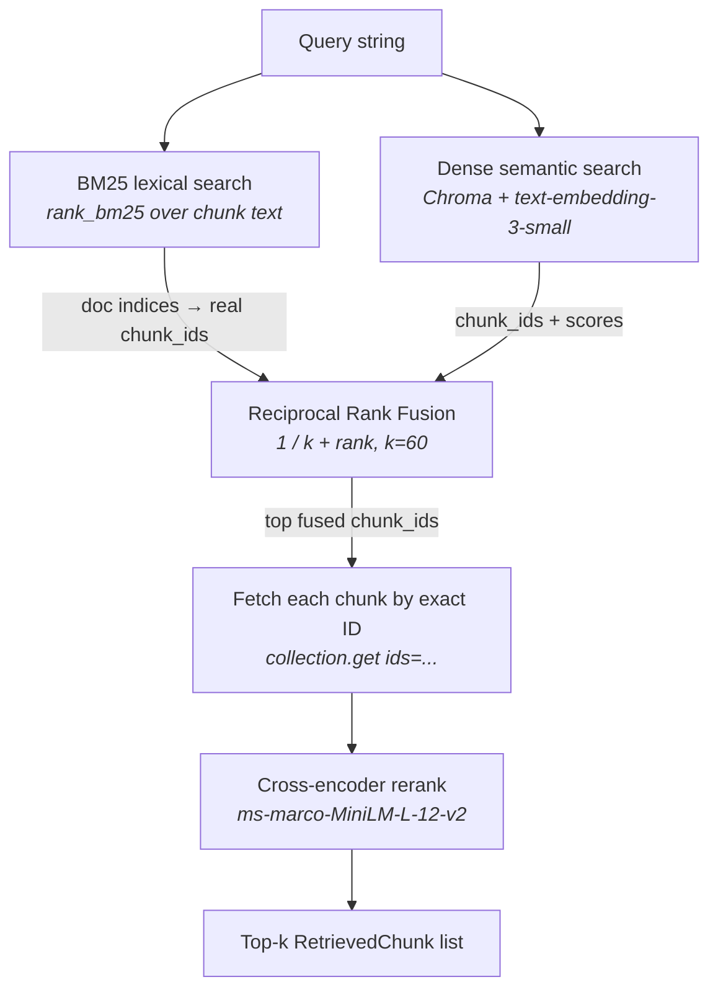

# Phase B — RAG Capability

> A complete walkthrough of what we built, why, and how the pieces fit together.
> Read alongside the files in the repo. Last updated: 2026-06-07.
>
> For the *concepts* behind these pieces (RAG, BM25, embeddings, RRF, cross-encoders,
> recall@k / MRR), see [phase-b-theory.md](phase-b-theory.md).

---

## 1. What Phase B is (and isn't)

**Phase B's goal:** turn a resume PDF into something *retrievable*. Parse it, chunk it, embed it into a vector store, and stand up a **hybrid retriever** (lexical + semantic + reranking) that can answer "which parts of this resume are relevant to query X?" — then **prove the retrieval quality with an eval gate**.

This is the first phase that touches the actual product. Phase A was plumbing; Phase B is the first load-bearing capability the agent (Phase D) and tools (Phase C) will lean on.

**Phase B's "Done when" criteria, all met:**
1. ✅ Given a resume PDF, parsing → chunking → indexing runs end-to-end
2. ✅ Hybrid retrieval (BM25 + dense + rerank) returns relevant chunks for sample queries
3. ✅ The eval script reports **recall@5 ≥ baseline** — we hit **recall@5 = 1.000** (baseline 0.60), recall@10 = 1.000, MRR = 1.000 on the real resume

**What's intentionally NOT in Phase B:**
- No job descriptions in the store yet — only the resume (job ingestion is Phase C)
- No multi-query expansion, no HyDE, no metadata filtering by section
- No agent calling the retriever (Phase D); no UI (Phase G)
- No Promptfoo/CI wiring — the eval runner exists and is CI-shaped, but it gets bolted into GitHub Actions in Phase F

**Honest caveat on the eval:** with a single resume the store holds only **6 chunks**, and the eval returns at most 5 results. A perfect 1.000 proves the pipeline *runs correctly and is genuinely hybrid* — it is **not yet a hard test of retrieval quality**. The gate gets discriminating once job descriptions land in the collection (Phase C+) and the golden set grows. That's called out again in §8.

---

## 2. The retrieval picture

What happens on a single `retriever.retrieve("Visual Inertial Odometry on a Jetson rover")` call:



Two retrieval *modalities* run in parallel and get **fused**, then a heavier model **reranks** the survivors:

- **BM25** (lexical): exact-term matching. Great when the query and the resume share vocabulary ("MobileNet", "Azure App Service"). Cheap, no embeddings.
- **Dense** (semantic): embeds the query with `text-embedding-3-small` and finds nearest neighbours in Chroma. Catches paraphrase ("containerization" ≈ "Docker") that BM25 misses.
- **Reciprocal Rank Fusion (RRF)**: combines the two ranked lists without needing their scores to be on the same scale — it only uses *rank position*. A chunk that ranks well in *either* list bubbles up; one that ranks well in *both* wins.
- **Cross-encoder reranker**: a small model that reads `(query, chunk)` *together* (not as separate embeddings) and scores true relevance. Slow per-pair, so it only runs on the fused shortlist, not the whole store.

That four-stage shape — **dual-modality → fuse → rerank** — is the canonical modern RAG retrieval stack. Building it (rather than a single `similarity_search`) is the marketable skill.

---

## 3. File-by-file walkthrough

### 3.1 `app/models/documents.py` — the data contracts

Three Pydantic models that everything else passes around:
- **`DocumentMetadata`** — `source_file`, `parsed_at`, `page_count`, `total_size_bytes`. Travels with every chunk.
- **`DocumentChunk`** — `content`, `chunk_index`, `page_number`, `metadata`. The atom of retrieval.
- **`ParsedResume`** — `filename`, `chunks[]`, `total_tokens`, `parse_duration_ms`. The output of parsing.

Why Pydantic and not dicts: the same fail-fast, typed discipline as Phase A's config. A malformed chunk fails at construction, not three layers deeper inside Chroma.

### 3.2 `app/services/resume_parser.py` — PDF → text → chunks

`parse_resume(file_path) -> ParsedResume` (async). The pipeline:
1. **Guard**: file exists, suffix is `.pdf`.
2. **Extract**: `UnstructuredPDFLoader` (same parser as pdf-rag, chosen in Phase A) pulls text out, handling layout and OCR fallback.
3. **Chunk**: `RecursiveCharacterTextSplitter(chunk_size=1000, chunk_overlap=200)` with a separator cascade `["\n\n", "\n", ". ", " ", ""]` — it tries to split on paragraph boundaries first, degrading to sentences, then words, only cutting mid-word as a last resort. The 200-char overlap means a skill mentioned at a chunk boundary isn't orphaned.
4. **Token estimate**: rough `len(text) // 4` — good enough for logging/cost sanity, not billing.

Our real resume produced **6 chunks** (`#0`–`#5`).

### 3.3 `app/services/vector_store.py` — Chroma bootstrap & indexing

- **`get_chroma_client()`** — `@lru_cache` singleton (same pattern as `get_settings()`). Wires `OpenAIEmbeddings(text-embedding-3-small)` + a persistent Chroma collection named `resumes` at `./data/vector_store`.
- **`index_resume_chunks(parsed_resume, resume_id)`** — transforms chunks into LangChain `Document`s and adds them to Chroma. Embeddings are generated automatically by the collection's embedding function.
- **`get_collection_size(name)`** — used by the eval gate to refuse to run against an empty store.

**The chunk_id scheme** is the linchpin of the whole phase:

```python
chunk_id = f"{chunk.metadata.source_file}#{chunk.chunk_index}"
# → "Arun Kumar - ML Engineer - 2026.pdf#0"
```

This deterministic ID is what the golden eval set references, what RRF fuses on, and what the reranker fetches by. **It has to be stable and shared across every stage** — a recurring theme in the bugs we hit (§6).

### 3.4 `app/services/retriever.py` — the HybridRetriever

The heart of Phase B. A class because it caches expensive state: the loaded cross-encoder model and a lazily-built BM25 index.

- **`_build_bm25_index()`** — pulls all documents *and their IDs* out of Chroma and builds a `BM25Okapi` index over the tokenized text. Stores `_bm25_docs` **and** `_bm25_ids` in parallel so a BM25 hit (which is a *position* in the corpus) can be mapped back to its real `chunk_id`.
- **`_bm25_search(query, top_k)`** — returns `(doc_index, score)` tuples.
- **`_dense_search(query, top_k)`** — `chroma.similarity_search_with_score(...)`, returns `(chunk_id, score)`.
- **`_reciprocal_rank_fusion(bm25, dense, k=60)`** — maps BM25 indices → real `chunk_id`s, then fuses both lists into `{chunk_id: rrf_score}`. The `k=60` constant is the standard RRF damping factor.
- **fetch-by-ID** — for each fused `chunk_id`, `collection.get(ids=[doc_id])` retrieves *exactly that chunk* so the content and the ID always correspond.
- **`_rerank_results(query, chunks, top_k)`** — the cross-encoder scores every `(query, chunk.content)` pair and re-sorts, truncating to `reranker_top_k`.
- **`retrieve(query, top_k, with_reranking=True)`** — orchestrates all of the above. The public entry point.

### 3.5 `app/services/eval_retrieval.py` — the metrics

Pure functions, trivially unit-testable:
- **`compute_recall_at_k(retrieved, expected, k)`** — fraction of the expected (relevant) chunks that appear in the top-k retrieved. "Did we find the right stuff?"
- **`compute_mrr(retrieved, expected)`** — `1 / rank` of the *first* relevant hit. "Did we rank the right stuff near the top?"
- **`run_eval_suite(retriever, golden, k_values)`** — runs every golden query through the retriever and averages the metrics.

Recall and MRR are complementary: recall ignores *order*, MRR is *all about* order. Reporting both is honest.

### 3.6 `evals/datasets/retrieval_golden.json` — the ground truth

8 `(query, expected_doc_ids)` pairs. **Every mapping was derived by reading the actual indexed chunk text**, not guessed — e.g. "MobileNet waste type detection Android application" → `#4`, because chunk `#4` is literally where that project is described. A golden set that doesn't correspond to real chunk content measures nothing.

### 3.7 `scripts/index_resume.py` — the indexing entry point (new)

`python -m scripts.index_resume <pdf>`. Parses + indexes a resume and **prints the real `chunk_id`s** so you can build a golden set against them. Run it once per resume before evaluating.

### 3.8 `evals/run_retrieval_eval.py` — the gate (new)

`python -m evals.run_retrieval_eval`. Loads the golden set, runs the suite, prints recall@5 / recall@10 / MRR, and:
- **guards an empty collection** (exit 2 — "index a resume first")
- **exits non-zero when recall@5 < baseline** (default 0.60)

That non-zero exit is deliberate: this file is already shaped to be dropped into GitHub Actions as the Phase F prompt/retrieval-regression gate. `--baseline` and `--dataset` are CLI-overridable.

---

## 4. Three cross-cutting concepts to keep in your head

### 4.1 Why fuse *and* rerank (they do different jobs)

```
BM25 list  ─┐
            ├─ RRF ─→ shortlist ─→ cross-encoder ─→ final ranking
Dense list ─┘   (cheap, recall)     (expensive, precision)
```

- **RRF maximises recall cheaply** — it casts a wide net by merging two complementary candidate sets, using only rank position so the two score scales never need normalising.
- **The cross-encoder maximises precision expensively** — it actually reads query+chunk together, so it only runs on the ~10-item shortlist, never the whole corpus.

Bi-encoder (dense) embeds query and document *separately*; cross-encoder embeds them *jointly* and is far more accurate but cannot be pre-indexed. Using each where it's strong is the whole point.

### 4.2 The chunk_id is the shared key — keep it stable everywhere

```
parse → "<file>#<index>"        (vector_store builds it)
index → stored as Chroma ID     (same string)
BM25  → corpus position → map back to the same chunk_id
RRF   → fuses on chunk_id
fetch → collection.get(ids=[chunk_id])
eval  → golden set references chunk_id
```

If *any* stage invents its own ID space, fusion silently drops half its inputs or mislabels content. Three of our four bugs (§6) were exactly this failure.

### 4.3 Recall@k vs MRR

```
retrieved: [C, A, B]   expected: {A, B}
recall@3 = 2/2 = 1.0   (both found)        ← order-blind
MRR      = 1/2 = 0.5   (first hit at rank 2) ← order-sensitive
```

A retriever can have perfect recall but mediocre MRR (right answers present, buried). The reranker's whole job is to push MRR up. Tracking both tells you *which* stage to tune.

---

## 5. Key design decisions

| Decision | Choice | Rationale |
|---|---|---|
| Retrieval strategy | Hybrid: BM25 + dense + RRF + rerank | The modern RAG default. Lexical and semantic catch different misses; fusion + rerank is the standard precision/recall trade. |
| Fusion method | Reciprocal Rank Fusion (k=60) | Score-scale agnostic — works across BM25 scores and cosine distances without normalising. The de-facto standard. |
| Reranker | `ms-marco-MiniLM-L-12-v2` cross-encoder | Small, fast, strong on short passages. Local (sentence-transformers), no extra API cost. |
| Embeddings | `text-embedding-3-small` | Cheap, good, matches the locked stack and pdf-rag. |
| Chunking | Recursive, 1000/200 | Paragraph-preferring splits with overlap so boundary skills aren't orphaned. |
| Chunk ID | `<filename>#<index>` | Deterministic, human-readable, stable across stages and runs. The shared key for fusion, fetch, and eval. |
| Eval metrics | recall@k + MRR | Complementary: presence vs ranking. Standard retrieval-quality pair. |
| Eval gate | non-zero exit below baseline | Reusable as-is for the Phase F CI regression gate. |

---

## 6. Bugs we hit getting it working (and how we fixed them)

The Phase B retrieval/index code existed from earlier commits but had **never run end-to-end** — the old smoke test bailed while parsing an empty placeholder PDF, so nothing downstream had ever executed against real data. Running it for the first time surfaced **four latent bugs**, all now fixed:

| # | Symptom | Cause | Fix |
|---|---|---|---|
| 1 | `Chroma.add_texts() got multiple values for argument 'metadatas'` — indexing crashed | `add_documents(documents, ids, metadatas=...)` passed metadata twice: the `Document`s already carry it, and `add_documents` forwards `metadatas` into `add_texts` | Drop the `metadatas=` kwarg; let the `Document` objects carry metadata |
| 2 | `Dense search failed` warning on every query → "hybrid" was silently BM25-only | Called `similarity_search_with_scores` (plural) — the langchain_chroma method is `similarity_search_with_score` (singular); the `AttributeError` was caught and swallowed | Fix the method name |
| 3 | BM25 results contributed nothing to fusion | RRF assigned BM25 hits synthetic IDs `bm25_{idx}`, mixing them with real `chunk_id`s; those fake IDs then failed the downstream fetch and were dropped | Map BM25 corpus indices back to real `chunk_id`s via the new `_bm25_ids` list |
| 4 | Reranker scored the wrong text; content mislabeled | Re-fetch used `similarity_search(query, k=1, filter={source_file})`, which returns the *most-similar* chunk in that file, not the chunk identified by the ID — so with one resume every candidate collapsed to the same chunk | Fetch each chunk by its exact ID: `collection.get(ids=[doc_id])` |

**The pattern across #2–#4:** a retrieval pipeline is a chain of stages that must agree on (a) the API surface and (b) a single ID space. A swallowed `AttributeError` and an inconsistent ID scheme turned a "hybrid + rerank" retriever into "dense-only, then BM25-only, then mislabeled" — and it still *ran*, just wrongly. The lesson: **integration bugs in RAG hide behind try/except and plausible-looking output; you only catch them by running real data through and measuring.**

Two tests had encoded the old buggy contracts and were updated to assert the correct behaviour:
- `test_index_resume_chunks_mock` — was asserting the `metadatas=` kwarg (bug #1); now asserts metadata travels on the `Document`s.
- `test_bm25_search_empty` — assumed an empty Chroma; once a real resume was indexed, `_bm25_search` rebuilt a non-empty index from the live collection. Made the "no usable index" path deterministic instead of DB-dependent.

---

## 7. How to verify everything still works

From the repo root, with the Phase A stack already up:

```bash
# (one-time) index a resume — prints the real chunk_ids
docker compose -f docker/docker-compose.yml exec app \
  python3 -m scripts.index_resume "data/uploads/<your_resume>.pdf"

# run the retrieval-quality gate
docker compose -f docker/docker-compose.yml exec app \
  python3 -m evals.run_retrieval_eval

# run the unit tests
docker compose -f docker/docker-compose.yml exec app \
  python3 -m pytest tests/ -q
```

Expected: the gate prints `RESULT: PASS ✅` with recall@5 ≥ 0.60 and exits 0; all unit tests pass.

> **Note on file ownership:** the container runs as root, so files it writes under `data/` (the Chroma store) are root-owned on the host. If you need host-side access, run `sudo chown -R arun:arun data/`.

---

## 8. What's deliberately missing (and where it lands)

| Missing piece | Lands in |
|---|---|
| Job descriptions in the vector store (makes the eval discriminating) | Phase C |
| Adzuna job search, gap analysis, project suggestions, interview Q&A | Phase C |
| The retriever wired in as an agent tool | Phase D |
| Multi-query expansion / HyDE / section-aware filtering | Future (if evals justify it) |
| Promptfoo config + GitHub Actions running this gate on every PR | Phase F |
| A larger golden set across multiple documents | Phase F (alongside gap/interview goldens) |
| Streamlit "upload resume → see retrieved chunks" UI | Phase G |

The single most important follow-up: **once Phase C adds job descriptions, the 6-chunk ceiling lifts and the eval becomes a real quality signal.** Revisit the golden set then.

---

## 9. Tech stack actually used in Phase B

Builds on the Phase A foundation; adds the RAG-specific pieces.

### Application (Python)

| Component | Package(s) | Role in Phase B |
|---|---|---|
| PDF parsing | `unstructured` (`UnstructuredPDFLoader`) | Extract text from the resume PDF |
| Chunking | `langchain-text-splitters` | Recursive 1000/200 character splitting |
| Vector store | `langchain-chroma`, `chromadb` | Persistent embedding store + similarity search |
| Embeddings | `langchain-openai` (`text-embedding-3-small`) | Dense vectors for semantic search |
| Lexical search | `rank-bm25` (`BM25Okapi`) | Keyword/term retrieval |
| Reranking | `sentence-transformers` (`CrossEncoder`) | `ms-marco-MiniLM-L-12-v2` precision rerank |
| Data contracts | `pydantic` | `DocumentChunk` / `ParsedResume` models |
| Tracing | `langfuse` | Every retrieval/index call traced (free from Phase A) |

### External

| Service | Usage |
|---|---|
| OpenAI API | `text-embedding-3-small` for indexing + dense query embedding |
| Hugging Face Hub | One-time download of the cross-encoder weights |

---

## 10. Skills demonstrated by Phase B

### Retrieval engineering (RAG)
- **Built a full hybrid retrieval pipeline** — BM25 + dense, fused with Reciprocal Rank Fusion, reranked with a cross-encoder. Not a toy `similarity_search`; the modern production shape.
- **Understood *why* each stage exists**: lexical vs semantic recall, RRF's scale-agnostic fusion, bi-encoder vs cross-encoder precision trade-offs, and where each belongs in the latency budget.
- **Designed a stable, shared chunk-ID scheme** as the contract across indexing, fusion, fetch, and evaluation.

### Evaluation & measurement
- **Implemented recall@k and MRR from first principles** and understood what each does (and doesn't) capture.
- **Built a CI-shaped eval gate** with a baseline threshold and non-zero exit — reusable directly as a regression gate.
- **Authored an honest golden set** mapped to real chunk content, and was candid about its current limits (6-chunk ceiling) rather than overselling a 1.000 score.

### Debugging integration failures
- **Diagnosed four interacting bugs** that left a "hybrid" retriever silently running dense-only, then BM25-only, then mislabeling reranked content — none of which threw a visible error.
- **Recognised the meta-lesson**: swallowed exceptions + inconsistent ID spaces produce plausible-but-wrong output that only real-data evaluation exposes.
- **Fixed the tests that encoded the buggy contracts** rather than deleting them — kept the regression coverage.

### Engineering hygiene
- **Clean separation**: parsing, storage, retrieval, and evaluation are independent, individually-testable services.
- **Operational entry points**: a one-command indexer and a one-command gate, both runnable in-container.
- **Fixed the missing `evals/` bind-mount** in docker-compose so the eval runner and dataset are live-editable like every other source dir.

---

## 11. Questions to ask yourself (interview-readiness check)

Can you answer these without looking?

1. Why combine BM25 and dense retrieval instead of using just one?
2. What does Reciprocal Rank Fusion give you that averaging the two score lists wouldn't?
3. What's the difference between a bi-encoder and a cross-encoder, and why does the cross-encoder only run on a shortlist?
4. Why must the `chunk_id` be identical across indexing, fusion, fetch, and the golden set?
5. Recall@5 is 1.000 — why is that *not yet* strong evidence of retrieval quality?
6. What's the practical difference between recall@k and MRR, and which one does the reranker improve?
7. Bug #4: why does `similarity_search(query, k=1, filter={source_file})` return the wrong chunk when a file has many chunks?
8. Why did three of the four bugs hide instead of crashing the app?
9. Why does the eval runner exit non-zero below baseline, and where will that property be used?
10. When job descriptions land in Phase C, what changes about how meaningful this eval is — and what would you do to the golden set?

If any are fuzzy, those are the right things to ask me about next.
